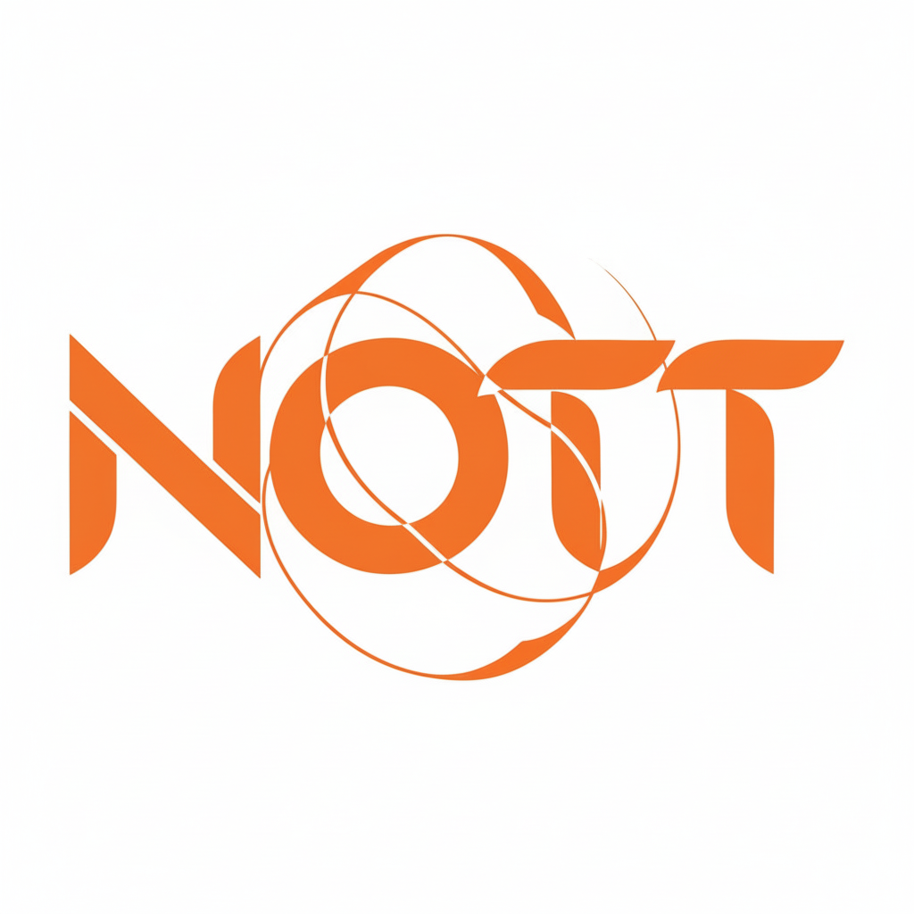

 

 

&nbsp;

&nbsp;

&nbsp;

---

## 🔶 &nbsp; Custom. Individual. Integrated.

### We build AI modules that connect directly to your outer systems — your database, ERP, CRM, or any external register. No generic plugins. No shared infrastructure. No Big Tech middlemen.

---

 

<table width="100%">
<tr>
<td width="33%" align="center" valign="top">

 

**⬡**

### Own AI Cluster

Models run on our own infrastructure.
No routing through OpenAI, Azure, or Google.
Your requests never touch Big Tech servers.

 

</td>
<td width="1" bgcolor="#222228"></td>
<td width="33%" align="center" valign="top">

 

**◈**

### Static Pricing

Buy access to a model port — use it without counting tokens or watching invoices spike. One price. Unlimited usage within port limits.

 

</td>
<td width="1" bgcolor="#222228"></td>
<td width="33%" align="center" valign="top">

 

**◎**

### Full Data Privacy

Client data never leaves NOTT infrastructure. No third-party logs. No telemetry. Promise-backed by architecture.

 

</td>
</tr>
</table>

 

---

## What we build

NOTT connects AI directly to your existing data — product catalogues, customer records, order history — and puts intelligent tooling in the hands of e-commerce operators.

 

<table width="100%">
<tr>
<td width="50%" valign="top">

### 📄 &nbsp;Content Generator
Upload an Excel sheet — AI outputs product descriptions, categories, tags, and SEO metadata at scale. Hours of copywriting work reduced to minutes.

</td>
<td width="50%" valign="top">

### 🤖 &nbsp;Storefront Assistant
Conversational AI embedded directly on your shop, trained on your specific catalogue, pricing, and policies. Always available, always on-brand.

</td>
</tr>
<tr>
<td width="50%" valign="top">

### 🔗 &nbsp;Data Connector
Hooks into your existing DB, ERP, CRM, or any external register — zero migration required. AI reads and writes where your data already lives.

</td>
<td width="50%" valign="top">

### 🖥 &nbsp;Admin Monitor
Unified dashboard to configure, observe, and control every active AI module across all your integrations — in real time.

</td>
</tr>
</table>

 

> **Custom development is our core offering.**
> Every client gets a module built specifically for their stack, their data shape, and their workflow.
> We don't sell subscriptions to generic tools.

 

---

## Why NOTT

 

<table width="100%">
<tr>
<td align="center" width="25%">

### ∞
**Unlimited usage**
per model port

</td>
<td align="center" width="25%">

### 0
**Third-party servers**
involved in your requests

</td>
<td align="center" width="25%">

### 1
**Flat monthly price**
no per-token surprises

</td>
<td align="center" width="25%">

### 100%
**Custom-built**
for your specific systems

</td>
</tr>
</table>

 

---

## Get in touch

 

<table width="100%">
<tr>
<td align="center">

🌐 &nbsp;**Website**
 
[https://nottlab.org/](#)

</td>
<td align="center">

✉️ &nbsp;**Email**
 
nott.ai.lab@gmail.com

</td>
<td align="center">

📞 &nbsp;**Phone**
 
+48 889 094 033

</td>
</tr>
</table>
 

---

*Pre-launch · 2025 · Built on our own infrastructure*

